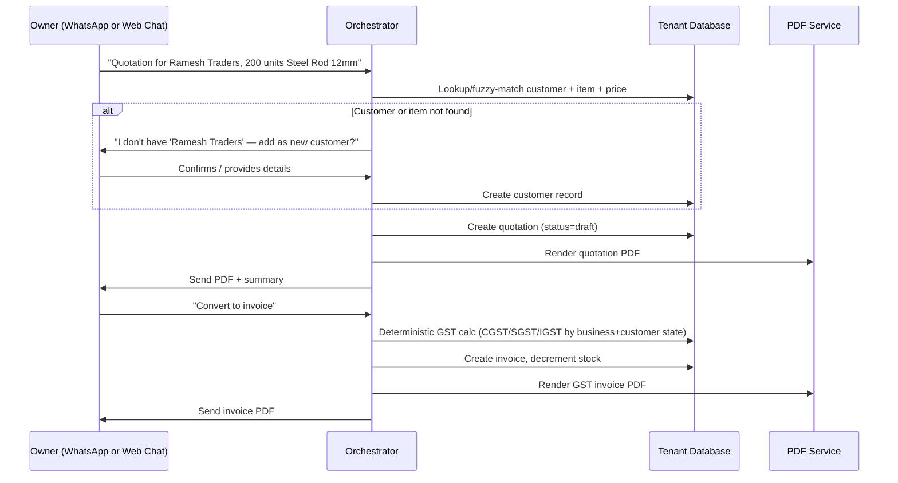
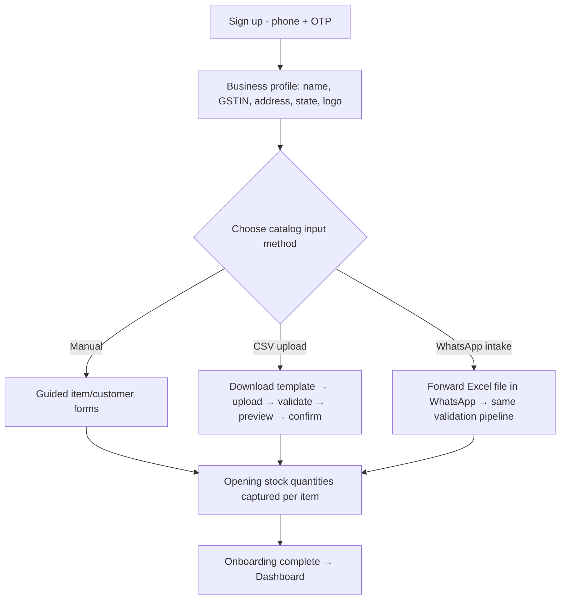
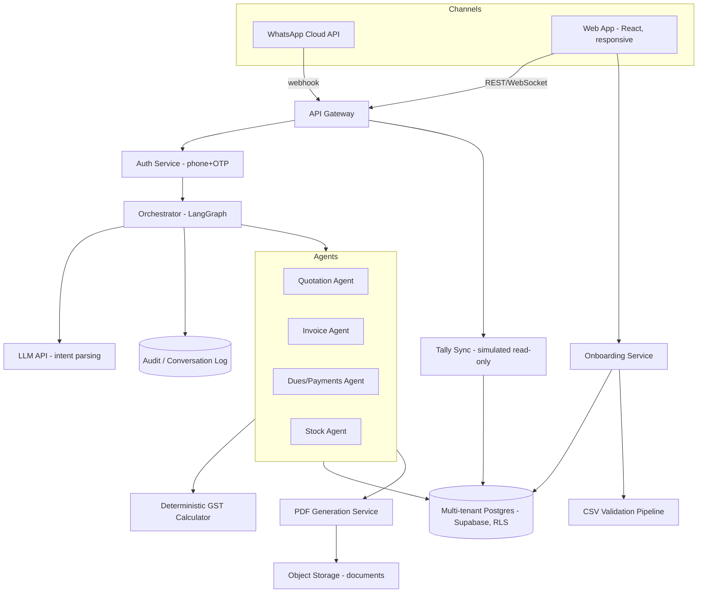

# PRD — M1M (Munim.ai) MVP
### WhatsApp + Web App Business Copilot for Indian SMEs
**Status:** MVP scope, ready for engineering handoff
**Scope boundary:** Exactly four features. Nothing else ships in this version.

---

## 1. Product Summary

M1M is a business copilot for Indian SMEs, reachable through two surfaces that share one backend and one agent brain:

1. **WhatsApp** — the owner's primary, zero-install interface. Natural language in, structured business action out.
2. **Web App (responsive, mobile + desktop)** — a customer-facing app with a login, a dashboard, and an embedded chat panel that talks to the *same* agent as WhatsApp. This is where onboarding happens, where data is bulk-managed, and where the owner goes when they want to see everything at a glance instead of asking one question at a time.

Both surfaces are **thin channels into one orchestrator.** No feature exists on one surface and not the other except where explicitly noted (onboarding is web-only; chat is available on both).

---

## 2. MVP Feature Scope (locked — do not expand)

| # | Feature | One-line description |
|---|---|---|
| 1 | Quotation Generation | Owner describes a quote in natural language → structured quotation → branded PDF |
| 2 | GST Invoice Generation | Same as above, or converts an existing quotation → statutory GST-compliant invoice PDF |
| 3 | Pending Payments / Dues Tracking | Owner asks who owes them money → list of unpaid/overdue invoices → send WhatsApp payment reminders |
| 4 | Inventory / Stock Check | Owner asks stock level for an item → current quantity, auto-decremented on invoice creation |

**Explicitly out of scope for this MVP** (do not build, even partially): Tally/Zoho/Busy live sync (read-only simulation only, see Section 7), payment gateway live collection, salary slips, delivery booking, multi-language, voice notes, OCR document upload, multi-branch/multi-warehouse, CRM/lead pipeline.

---

## 3. The Two Surfaces

### 3.1 WhatsApp
- Official Meta WhatsApp Business Cloud API (test number for MVP/pilot phase; production number once out of pilot).
- Stateless from the channel's point of view — every inbound message is authenticated by phone number → mapped to a `user` → `tenant`, then handed to the same orchestrator the web app uses.
- Outbound: text replies + PDF document messages (quotations/invoices) + template messages for anything outside the 24-hour session window (payment reminders sent proactively must use an approved template).

### 3.2 Web App
- **Responsive**, not two separate builds — one codebase, breakpoints for mobile and desktop. Mobile is the more important target (owners check this on their phone more than a laptop), desktop is for the "sit down and manage everything" sessions, especially onboarding and bulk data entry.
- **Structure:**
  - `Login` (phone number + OTP — reuse WhatsApp's own number as identity, no separate password system to build for MVP)
  - `Onboarding wizard` (Section 6 — one-time, or re-enterable from Settings)
  - `Dashboard` — today's summary, pending dues, low stock alerts (this is the "at a glance" view; think of it as the visual sibling of the WhatsApp "summarize today's business" reply)
  - `Chat panel` — embedded, same agent, same conversation history as WhatsApp (a message sent from web should be visible in WhatsApp history and vice versa — **one conversation log, two windows into it**)
  - `Documents` — list/search of all generated quotations and invoices, downloadable PDFs
  - `Customers` — list, add/edit, view dues per customer
  - `Inventory` — item list, stock levels, add/edit items and prices (this is also where ongoing catalog maintenance happens after onboarding, not just at signup)
  - `Settings` — business profile, GST details, staff/roles, Tally connection status (simulated per earlier discussion)

### 3.3 Why both, and why this split
WhatsApp is the low-friction daily-use surface — it's where the actual product thesis lives. The web app exists because **onboarding, bulk catalog management, and "see everything at once" review are genuinely bad experiences over chat.** Nobody wants to type 200 item names and prices into WhatsApp one message at a time. The web app is not a second product — it's the surface for the parts of the job that are inherently visual/tabular, while WhatsApp stays the surface for the parts that are inherently conversational and in-the-moment.

---

## 4. Data That Varies Per Business — And How It Gets In

This is the core design question you flagged, so it gets its own section rather than being buried in onboarding.

### 4.1 What varies per business
- **Item/product catalog** — names, SKUs, units, prices (these change often, not just at signup)
- **HSN/SAC codes and GST rates per item** — required for correct invoice tax calculation, and genuinely different across a hardware distributor vs. a clinic vs. a restaurant
- **Opening stock quantities** — a snapshot at the moment they start using M1M
- **Customer list** — names, phone numbers, GSTIN (if B2B), existing dues if migrating mid-relationship
- **Business's own GST profile** — their GSTIN, registered state (this determines CGST+SGST for intra-state vs. IGST for inter-state invoices — cannot be hardcoded, must be captured at onboarding)
- **Branding** — business name, logo, address for the PDF letterhead

### 4.2 Yes — this is onboarding. It cannot be anything else.
There is no external source M1M can pull this from automatically in the MVP (that's exactly what the deferred Tally-sync work would eventually help with). For the MVP, onboarding is unavoidable — the design goal is making it **as low-effort as possible for three different catalog sizes**, not avoiding it.

### 4.3 Three onboarding paths, offered together (business picks what fits)

| Path | Best for | How it works |
|---|---|---|
| **Manual entry (guided form)** | Service businesses, clinics, small kirana — under ~30 items | Step-by-step web form: add item name, price, unit, HSN code (with a searchable HSN lookup helper, not free typing), starting stock. Same for customers. |
| **CSV/Excel bulk upload** | Wholesale, distribution, manufacturing — large catalogs | A downloadable template (`items.csv`, `customers.csv`) with clear columns; most SMEs can export a rough item list from Tally/Vyapar/Excel already and just need to fit it into the template. Backend validates and previews before committing (show "we found 214 items, 3 rows have errors — fix and re-upload" rather than a silent partial import). |
| **WhatsApp-native intake** | Owners who don't want to sit at a desktop at all | Owner sends a photo of their existing price list, or forwards an existing Excel file, directly in WhatsApp during onboarding. MVP scope for this: accept the file, store it, and route it to the *same* CSV validation pipeline (photo-to-structured-data via OCR is explicitly Phase 2 — for MVP, WhatsApp-native intake only handles forwarded Excel/CSV files, not photos, to avoid taking a dependency on OCR accuracy for something as sensitive as pricing). |

### 4.4 GST profile and business identity — always manual, always short
Regardless of catalog size, the business's own GSTIN, legal name, address, and state are a five-field form, always manual, always required before the first invoice can be generated (this is the one piece of onboarding with zero shortcuts, since it's a compliance requirement, not a convenience feature).

### 4.5 Ongoing maintenance (not just day-one)
Prices and stock change constantly — onboarding is the *first* load, not the only load. The `Inventory` tab in the web app is where an owner edits a price or adds a new item afterward; this should reuse the exact same add/edit form as onboarding, not a separate code path.

---

## 5. Core User Flows

### 5.1 Quotation → Invoice (either surface)



### 5.2 Dues check + reminder

```mermaid
flowchart LR
    A[Owner: "Who owes me money?"] --> B[Query invoices where status != paid AND due_date passed]
    B --> C[Return list: customer, amount, days overdue]
    C --> D{Owner requests reminder}
    D -->|"Send reminders"| E[Queue WhatsApp template message per overdue customer]
    E --> F[Log to conversation_log + mark reminder_sent_at]
```

### 5.3 Stock check

```mermaid
flowchart LR
    A[Owner: "Stock left for Steel Rod 12mm?"] --> B[Query stock table by item, tenant]
    B --> C[Return quantity + last_updated]
```

### 5.4 Onboarding (web app only)



---

## 6. System Architecture



**Key architectural decisions:**
- **One orchestrator, two channel adapters.** WhatsApp and the web app's chat panel both call the same agent layer through a shared `ChannelAdapter` interface — a message sent via one surface is logged into the same `conversation_log`, so history is unified regardless of which surface the owner used that day.
- **Multi-tenant Postgres (Supabase) with row-level security from day one.** This is a real product with real onboarded businesses now, not a single-tenant demo — every table carries `tenant_id`, every query is scoped by RLS policy, not just application-layer filtering.
- **GST math is never an LLM call.** The calculator is a deterministic function keyed on business state + customer state + item HSN/GST-rate, exactly as in the demo build — this doesn't change just because it's now a "real" product.
- **Tally integration stays simulated in this MVP**, per the earlier discussion — a read-only status panel and ID-mapping display, no real write-back, clearly labeled as such internally in code comments and externally in the UI.

---

## 7. Simulated Tally Integration (carried over from the demo, now productized)

Even in the real product, do **not** build live Tally write-back in this MVP. What ships:
- A `tally_connection` table per tenant: `status` (connected/not_connected — user can toggle it on in Settings for demo/pilot purposes), `last_synced_at` (a realistic-looking but non-live timestamp for MVP), `mode` (always `read_only` for now).
- An `external_id_map` table: `internal_entity_type`, `internal_id`, `external_system` ('tally'), `external_id` — populated with placeholder/simulated values for demo tenants, structured so real sync logic can populate it for real in Phase 2 without a schema change.
- Every invoice record has a visible `tally_push_status` field (`not_applicable`, `pending`, `pushed`) — for MVP this stays at `pending` with a disabled UI action, honestly labeled.

---

## 8. Database Schema (Postgres / Supabase, multi-tenant)

```sql
CREATE TABLE tenant (
    id UUID PRIMARY KEY DEFAULT gen_random_uuid(),
    business_name TEXT NOT NULL,
    gstin TEXT,
    state TEXT NOT NULL,          -- required for CGST/SGST vs IGST logic
    address TEXT,
    logo_url TEXT,
    created_at TIMESTAMPTZ DEFAULT now()
);

CREATE TABLE app_user (
    id UUID PRIMARY KEY DEFAULT gen_random_uuid(),
    tenant_id UUID REFERENCES tenant(id),
    phone TEXT NOT NULL,
    name TEXT,
    role TEXT DEFAULT 'owner',    -- owner, staff, accountant
    created_at TIMESTAMPTZ DEFAULT now()
);

CREATE TABLE customer (
    id UUID PRIMARY KEY DEFAULT gen_random_uuid(),
    tenant_id UUID REFERENCES tenant(id),
    name TEXT NOT NULL,
    phone TEXT,
    gstin TEXT,
    state TEXT,                   -- needed to determine intra vs inter-state tax
    address TEXT,
    created_at TIMESTAMPTZ DEFAULT now()
);

CREATE TABLE item (
    id UUID PRIMARY KEY DEFAULT gen_random_uuid(),
    tenant_id UUID REFERENCES tenant(id),
    name TEXT NOT NULL,
    hsn_code TEXT,
    gst_rate_percent NUMERIC NOT NULL,
    unit_price NUMERIC NOT NULL,
    unit TEXT DEFAULT 'pcs',
    created_at TIMESTAMPTZ DEFAULT now()
);

CREATE TABLE stock (
    item_id UUID REFERENCES item(id) PRIMARY KEY,
    tenant_id UUID REFERENCES tenant(id),
    quantity_available NUMERIC NOT NULL,
    last_updated TIMESTAMPTZ DEFAULT now()
);

CREATE TABLE quotation (
    id UUID PRIMARY KEY DEFAULT gen_random_uuid(),
    tenant_id UUID REFERENCES tenant(id),
    customer_id UUID REFERENCES customer(id),
    quotation_number TEXT,
    status TEXT DEFAULT 'draft',
    subtotal NUMERIC,
    pdf_url TEXT,
    created_at TIMESTAMPTZ DEFAULT now()
);

CREATE TABLE quotation_line (
    id UUID PRIMARY KEY DEFAULT gen_random_uuid(),
    quotation_id UUID REFERENCES quotation(id),
    item_id UUID REFERENCES item(id),
    quantity NUMERIC NOT NULL,
    unit_price NUMERIC NOT NULL,
    line_total NUMERIC NOT NULL
);

CREATE TABLE invoice (
    id UUID PRIMARY KEY DEFAULT gen_random_uuid(),
    tenant_id UUID REFERENCES tenant(id),
    customer_id UUID REFERENCES customer(id),
    quotation_id UUID REFERENCES quotation(id),
    invoice_number TEXT,
    subtotal NUMERIC,
    cgst_amount NUMERIC,
    sgst_amount NUMERIC,
    igst_amount NUMERIC,
    total_amount NUMERIC,
    status TEXT DEFAULT 'unpaid',
    due_date DATE,
    pdf_url TEXT,
    tally_push_status TEXT DEFAULT 'not_applicable',
    created_at TIMESTAMPTZ DEFAULT now()
);

CREATE TABLE invoice_line (
    id UUID PRIMARY KEY DEFAULT gen_random_uuid(),
    invoice_id UUID REFERENCES invoice(id),
    item_id UUID REFERENCES item(id),
    quantity NUMERIC NOT NULL,
    unit_price NUMERIC NOT NULL,
    gst_rate_percent NUMERIC NOT NULL,
    line_total NUMERIC NOT NULL
);

CREATE TABLE payment (
    id UUID PRIMARY KEY DEFAULT gen_random_uuid(),
    invoice_id UUID REFERENCES invoice(id),
    amount NUMERIC NOT NULL,
    method TEXT,
    paid_at TIMESTAMPTZ DEFAULT now()
);

CREATE TABLE conversation_log (
    id UUID PRIMARY KEY DEFAULT gen_random_uuid(),
    tenant_id UUID REFERENCES tenant(id),
    channel TEXT,                 -- 'whatsapp' or 'web'
    direction TEXT,
    raw_message TEXT,
    detected_intent TEXT,
    agent_invoked TEXT,
    created_at TIMESTAMPTZ DEFAULT now()
);

CREATE TABLE tally_connection (
    tenant_id UUID REFERENCES tenant(id) PRIMARY KEY,
    status TEXT DEFAULT 'not_connected',
    mode TEXT DEFAULT 'read_only',
    last_synced_at TIMESTAMPTZ
);

CREATE TABLE external_id_map (
    id UUID PRIMARY KEY DEFAULT gen_random_uuid(),
    tenant_id UUID REFERENCES tenant(id),
    internal_entity_type TEXT,
    internal_id UUID,
    external_system TEXT,
    external_id TEXT
);

-- Row-level security enabled on every tenant-scoped table
ALTER TABLE customer ENABLE ROW LEVEL SECURITY;
-- (repeat per table; policy: tenant_id = current_setting('app.current_tenant')::uuid)
```

---

## 9. API Surface (backend endpoints the web app and internal services use)

| Endpoint | Method | Purpose |
|---|---|---|
| `/auth/otp/request` | POST | Send OTP to phone |
| `/auth/otp/verify` | POST | Verify OTP, issue session |
| `/onboarding/business-profile` | POST | Save GSTIN, state, name, address, logo |
| `/onboarding/items/manual` | POST | Add single item |
| `/onboarding/items/bulk-upload` | POST | Upload CSV, returns validation preview |
| `/onboarding/items/bulk-confirm` | POST | Commit previewed CSV import |
| `/onboarding/customers/bulk-upload` | POST | Same pattern for customers |
| `/chat/message` | POST | Send a message to the orchestrator (used by web chat panel) |
| `/chat/history` | GET | Fetch unified conversation log (web + WhatsApp) |
| `/documents` | GET | List generated quotations/invoices |
| `/documents/{id}/pdf` | GET | Download a specific PDF |
| `/customers` | GET/POST/PUT | CRUD for customer list |
| `/items` | GET/POST/PUT | CRUD for item catalog (also used post-onboarding for price updates) |
| `/dashboard/summary` | GET | Today's/weekly summary data for the Dashboard tab |
| `/webhooks/whatsapp` | POST | Meta webhook receiver |

---

## 10. Tech Stack

| Layer | Choice | Notes |
|---|---|---|
| Web frontend | React (responsive, mobile+desktop breakpoints) | Single codebase |
| Backend | FastAPI (Python) | Matches orchestrator/agent stack |
| Orchestration | LangGraph | Consistent with prior architecture research |
| LLM | Gemini API (or Claude API for production quality once past free-tier demo stage) | Intent parsing only, never tax math |
| Database | Supabase Postgres, RLS enabled | Multi-tenant from day one |
| File/object storage | Supabase Storage | Generated PDFs |
| PDF generation | WeasyPrint | Same as demo build |
| WhatsApp | Meta Cloud API (test number → production number post-pilot) | |
| Auth | Phone + OTP (Supabase Auth or custom OTP via WhatsApp/SMS) | No password system for MVP |
| CSV parsing/validation | Pandas + a defined schema validator | Shared between onboarding and ongoing catalog edits |

---

## 11. Non-Functional Requirements

- **Every write action that affects money (invoice creation, GST calc) must be deterministic and unit-tested independently of the LLM** — the LLM extracts structured intent, a plain function computes tax.
- **Role-based access**: Owner sees everything; Staff can be scoped to inventory-only or quotation-only actions (schema supports this now even if UI for granular permission-setting is minimal in MVP).
- **Audit log is append-only** and covers every document generated and every agent action, on both channels.
- **Onboarding must never block on a missing field it can reasonably ask for later** — e.g., don't force every item to have a photo or a barcode; only GSTIN/state/name/price/HSN are truly required to generate a compliant invoice.

---

## 12. Explicit Out-of-Scope List (repeat, for engineering clarity)

Do not build in this MVP: live Tally/ERP write-back, live payment gateway collection, OCR-based photo-to-catalog import, voice notes, multi-language, multi-branch/warehouse, salary/HR, delivery/logistics booking, granular permission UI beyond Owner/Staff/Accountant role field, analytics beyond the basic dashboard summary.

---

*This document assumes the reader has context from the prior research/architecture documents (competitive landscape, deployment/Tally research, and the original demo PRD) — this version formalizes the same four features as a real onboarded multi-tenant product across two surfaces, rather than a single scripted demo.*
